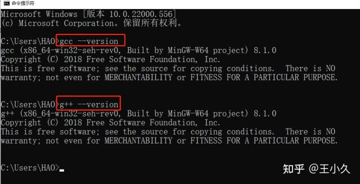
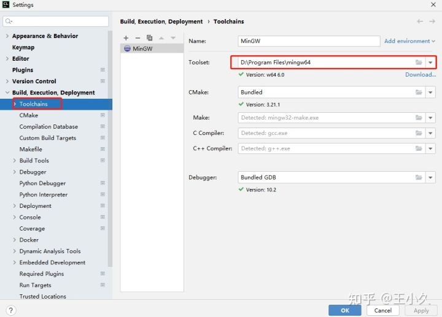

https://zhuanlan.zhihu.com/p/482962179

# CLions + Mingw-w64 + Boost库开发CMake应用

[](https://www.zhihu.com/people/tian-sheng-wo-cai-bi-you-yong-72-93)

[王小久](https://www.zhihu.com/people/tian-sheng-wo-cai-bi-you-yong-72-93)

久久为功，慢慢地做好每一件事情。

## 引言：

CMake编译的C、C++应用程序在Linux系统上开发是十分方便的，也可借助强大的IDE环境进行调试等操作，但是Linux系统不方便同时开发应用程序和办公。

因此，本人想在Windows上开发CMake应用，再无缝迁移到Linux上使用。按照网络上的博客文章操作会遇到种种问题，下面记录一种可行的解决方案和详细解释环境搭建的过程，以便参考使用。

## 环境说明：

JetBrains的IDE环境凭借着强大的代码补全，代码联想等操作被广大开发者热爱。针对C、C++程序，JetBrains推出了CLion产品。CLion产品是没有社区版本供免费使用的，但是作为学生或老师，可以用大学邮箱申请JetBrain账号，获取JetBrains系列产品的教育版。下面提供JetBrains账号申请链接：

[https://www.jetbrains.com/shop/eform/students](https://link.zhihu.com/?target=https%3A//www.jetbrains.com/shop/eform/students)

申请账号后，即可下载CLion教育版安装程序，点击双击即可。

Mingw-w64是C、C++程序编译器在Windows上的发行版本，Mingw是其32位版本，但目前电脑机器基本都是64位机器，因此使用Mingw-64作为程序的编译器。Windows上也有其他的主流C、C++编译器，比如Visual Stuido 的 msvc等等。但为了搭配CLion使用，刻意避开了VS的MSVC。同时值得注意的是，安装CLion程序后，CLion本身也内置了mingw的编译器，但是其编译器在编译boost库出现一些问题。所以，单独安装mingw-w64的编译器。

Boost库：这是C、C++程序的一个高级库，可以方便程序快速搭建程序，被广泛使用。

## 搭建步骤：

步骤1：安装Clion教育版本；安装完成后，打开CLION，登录你的账号即可免费使用。

步骤2：下载mingw-w64，下面直接提供安装包离线下载链接：

该博客提供了蓝奏云的下载：[mingw-w64蓝奏云下载](https://link.zhihu.com/?target=https%3A//blog.csdn.net/ftimes/article/details/109723250)

步骤3：把mingw-w64的bin路径添加到系统环境变量，通过系统终端命令行，查询gcc, g++版本验证系统已经具备C、C++编译器。



步骤4：编译Boost库，从官网[下载Boost](https://link.zhihu.com/?target=https%3A//www.boost.org/)，当前最新版本是1.78.0。

根据[该博客](https://link.zhihu.com/?target=https%3A//blog.csdn.net/m0_47696151/article/details/110133728)指定编译器为gcc完成boost库安装。


步骤5：CLion项目中tookchain工具链，通过指定mingw-w64的安装目录，切换默认C、C++编译工具为mingw-w64。



步骤6：Clion项目中CMakelist添加Boost路径。

```cmake
project(xxxxx)

cmake_minimum_required (VERSION 2.6)

IF(NOT CMAKE_BUILD_TYPE)
    SET(CMAKE_BUILD_TYPE "RELEASE")
ENDIF()

include_directories("inc")
file(GLOB SOURCES "src/*.cpp")
add_executable(xxxxx ${SOURCES})

set(BOOST_ROOT "D:\\Boost\\boost_install")
set(Boost_LIBRARIES ${BOOST_ROOT}\\include)
set(Boost_LIBRARIES ${BOOST_ROOT}\\lib)

# Find Boost
find_package(Boost REQUIRED COMPONENTS program_options system filesystem)
include_directories( ${Boost_INCLUDE_DIRS} )
target_link_libraries(xxxxx ${Boost_LIBRARIES})
```

至此，全部过程搭建完毕。

编辑于 2022-03-18 10:09